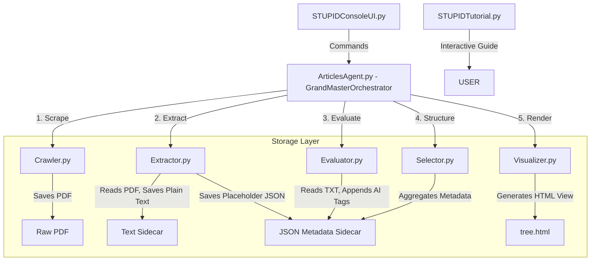

# 📖 STUPID System Architecture & Technical Design Manual

This technical manual details the system design, codebase architectures, API endpoints, data sidecar formats, and execution rules governing the offline literature ingestion and semantic synthesis pipeline.

---

## 1. System Design Abstractions

To guarantee seamless future migration from a local terminal prototype to an enterprise cloud environment, the system strictly separates interface from implementation using the **Strategy Design Pattern**.

### 1.1 Model Provider Interface
*   **Role**: Decouples the application loop from specific execution frameworks.
*   **Design**: Swaps between low-cost local instances (Ollama, vLLM) and high-throughput production cloud endpoints (OpenAI, Anthropic).

### 1.2 Storage Provider Interface
*   **Role**: Abstracts storage operations.
*   **Design**: Translates standard file reads/writes to either a local POSIX filesystem bundle or an enterprise cloud object store (AWS S3, MinIO).

### 1.3 Database & Indexing Interface
*   **Role**: Handles hybrid operational data.
*   **Design**: Maps abstract relational constraints and vector embeddings to lightweight local configurations (SQLite + native vector extensions) or enterprise distributed hybrid vector stores (PgVector, Qdrant).

---

## 2. Pipeline Execution Architecture

The framework consists of **UI layers**, an **orchestration layer**, and **engine components** that interact through structured file sidecars.



### 2.1 Shorthand Component Pipeline Flow
```text
   [Run Command]
         │
         ▼
 ┌───────────────┐
 │   Crawler     │ ──► Loops through active branches:
 └───────────────┘     ┌─ Computes union of global + branch-specific search phrases.
         │             └─ Checks target sources and runs downloads.
         ▼
 ┌───────────────┐
 │   Extractor   │ ──► Reads active branch directories:
 └───────────────┘     ┌─ Converts PDFs to TXT sidecars.
                       └─ Creates placeholder JSON metadata files.
         │
         ▼
 ┌───────────────┐
 │   Evaluator   │ ──► Scans TXT sidecars:
 └───────────────┘     ┌─ Extracts the first 6,000 characters.
                       ├─ Loads semantic tags list and description logic.
                       ├─ Streams LLM response and parses strict JSON.
                       └─ Writes tags, summary, and criteria version to metadata.
         │
         ▼
 ┌───────────────┐
 │   Selector    │ ──► Aggregates all *_meta.json files:
 └───────────────┘     ┌─ Performs upfront condition filtering (booleans, tags, strings).
                       └─ Recursively groups remaining data into a nested tree dict.
         │
         ▼
 ┌───────────────┐
 │  Visualizer   │ ──► Outputs presentation layer:
 └───────────────┘     ┌─ Renders interactive node tree directly to console.
                       └─ Exports styled CSS/HTML page to Visualizations/tree.html.
```

---

## 3. Codebase Class & API Reference

### 3.1 Class: `HierarchicalQueryEngine` (`Selector.py`)
Acts as the **Information Retrieval Layer** of the pipeline. It scans all distributed `_meta.json` sidecar files across the workspace and builds a dynamic parent-child classification tree based on runtime taxonomy groupings.

#### `__init__(self, storage_root="./downloaded_research", config_path="./Configuration/targets_config.json")`
*   **`storage_root`** *(str)*: Path to scan for metadata files.
*   **`config_path`** *(str)*: Path to read tracking parameters.

#### `build_query_tree(self, records: list, conditions: list, current_depth: int = 0) -> dict`
*   **`records`** *(list of dicts)*: Raw metadata records aggregated from all `_meta.json` file sidecars.
*   **`conditions`** *(list of strings)*: The sequence of tracking fields to group by, ordered from parent down to child level (e.g. `["branch", "relevant", "pub_year"]`).
*   **`current_depth`** *(int)*: Current recursion level index.
*   **Returns**: Nested `dict` representing the compiled parent-child hierarchy tree. It recursively classifies records under two structural node types:
    *   **Conditional Node**: `{"type": "conditional_node", "split_by_field": field_name, "branches": {value: child_node}}`
    *   **Leaf Cluster**: `{"type": "leaf_cluster", "papers_count": num, "papers": [...]}`

#### `_get_nested_value(self, record: dict, field_path: str)`
*   Translates shorthand keywords (e.g. `relevant`, `pub_year`, `institute`) into their corresponding JSON paths in the metadata cards schema.

---

### 3.2 Class: `LocalAIEvaluator` (`Evaluator.py`)
Acts as the **AI Reasoning Layer**. It feeds raw document text to a local LLM along with the branch's active `semantic_requirements` and configuration tag extraction guidelines.

#### `evaluate_all_new_sidecars(self, target_branch: str = None, limit: int = None, prioritized_metas: list = None)`
*   Scans the storage directory, identifies files that need evaluation, sorts tasks by PDF modification time descending, and processes them up to the set `limit`.

#### `evaluate_document(self, text_content: str, criteria_expression: str, categories: list = None, branch_vocab: list = None) -> dict`
*   Submits the first 6,000 characters of the paper to the local model.
*   **Returns**: Dictionary containing parsed JSON tags (`is_relevant`, `confidence_score`, `reasoning_summary`, `short_summary`, and fields for each AI category like `pub_year`, `institute`).

---

## 4. Data Models & Triad Sidecar Filesystem

The system uses a **Triad Sidecar** filesystem design for each ingested paper under `downloaded_research/<branch_name>/`:
1.  **Raw Binary File (`[doc_id].pdf`)**: The downloaded PDF document.
2.  **Plain Text File (`[doc_id].txt`)**: The cleaned, extracted plain text of the document.
3.  **Metadata File (`[doc_id]_meta.json`)**: Contains metrics, relevance assessments, and AI taxonomy tags:

```json
{
    "document_id": "unique_paper_id",
    "document_title": "Paper Title",
    "processed_timestamp": "ISO_8601_Timestamp",
    "evaluated_under_version": 2,
    "file_metrics": {
        "character_count": 859025,
        "estimated_words": 140200
    },
    "agent_relevance_eval": {
        "is_evaluated": true,
        "is_relevant": true,
        "confidence_score": 0.95,
        "reasoning_summary": "Single-sentence pass/fail reason.",
        "short_summary": "Comprehensive 3-8 sentences summary outlining the paper's core goals, methods, and results."
    },
    "semantic_tags": {
        "pub_year": ["2025"],
        "institute": ["Stanford University"],
        "innovation_focus": ["Tag1"],
        "methodology_branch": ["Tag2"]
    }
}
```

---

## 5. Skipping and Idempotency Rules

To maximize efficiency and minimize local LLM compute, every phase of the pipeline enforces strict skipping rules:

| Pipeline Component | Operation | Skip Condition | What is Skipped |
| :--- | :--- | :--- | :--- |
| **Crawler** | PDF Download | File `downloaded_research/<branch>/<doc_id>.pdf` already exists. | Skips network requests and scraping tasks for that paper. |
| **Extractor** | PDF Text Extraction | File `downloaded_research/<branch>/<doc_id>.txt` exists and character count > 0. | Skips running PDF parser, layout reconstruction, and regex cleaning. |
| **Evaluator** | AI LLM Evaluation | 1. Sidecar JSON has `"is_evaluated": true`. <br>2. Sidecar `"evaluated_under_version"` matches active branch criteria version. <br>3. Sidecar contains all active AI categories in `"semantic_tags"` (e.g. `pub_year`, `institute`). | Skips Ollama API calls and deep reasoning token generation loops. |
| **Selector** | Node Partitioning | The paper does not match the upfront filters specified by the user (e.g. `relevant=true, branch=ccd_sensors`). | The paper is excluded from the dynamic query tree layout entirely. |
